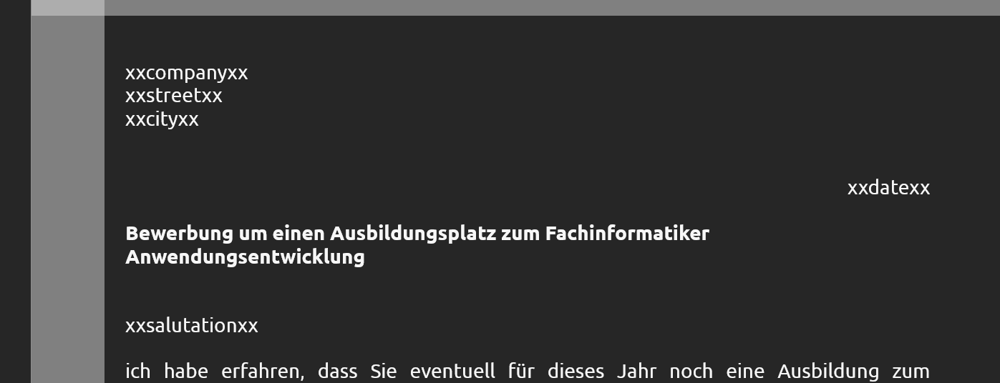
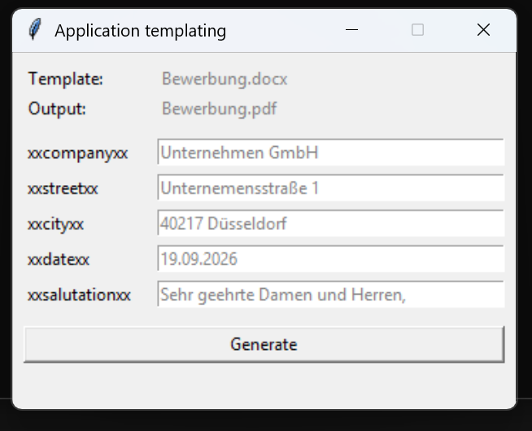
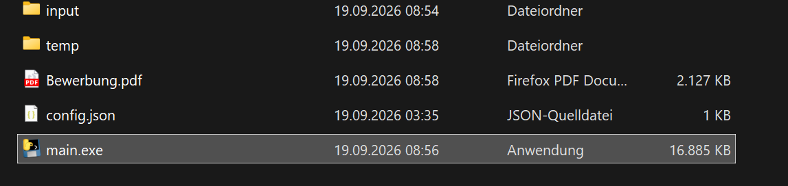
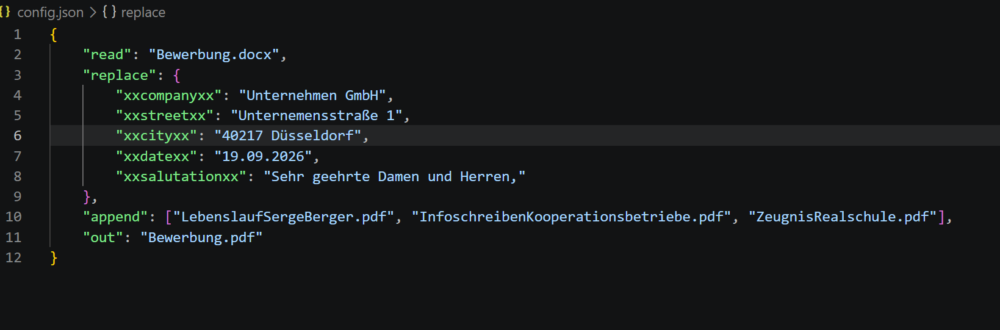

# Application Templating

Fill placeholders in a Word (`.docx`) template and merge the result with additional PDFs into a single application PDF.

## Features

- Graphical interface with one input field per placeholder — the configured value is shown as placeholder text and is used if you leave the field empty
- **Generate** button (or Enter) replaces the placeholders, converts the document to PDF and appends the configured attachments
- Command-line mode for scripted use
- Everything is driven by `config.json`, no code changes needed

## Usage

1. Run `main.exe` (or `run.bat` when running from source)
2. The window shows one field per placeholder; type a value to override it, or leave it empty to use the default from `config.json`
3. Click **Generate** — the merged PDF is written to the output file configured in `config.json`

## Configuration (`config.json`)

| Key | Meaning |
| --- | --- |
| `read` | The `.docx` template that contains the placeholders |
| `replace` | One entry per placeholder: the key is the placeholder used in the template (e.g. `xxcompanyxx`), the value is the default shown in the GUI |
| `append` | PDF files appended after the converted template, in order |
| `out` | Name of the generated PDF |

Add, remove or rename placeholders by editing the `replace` section — the GUI always shows exactly these fields.
